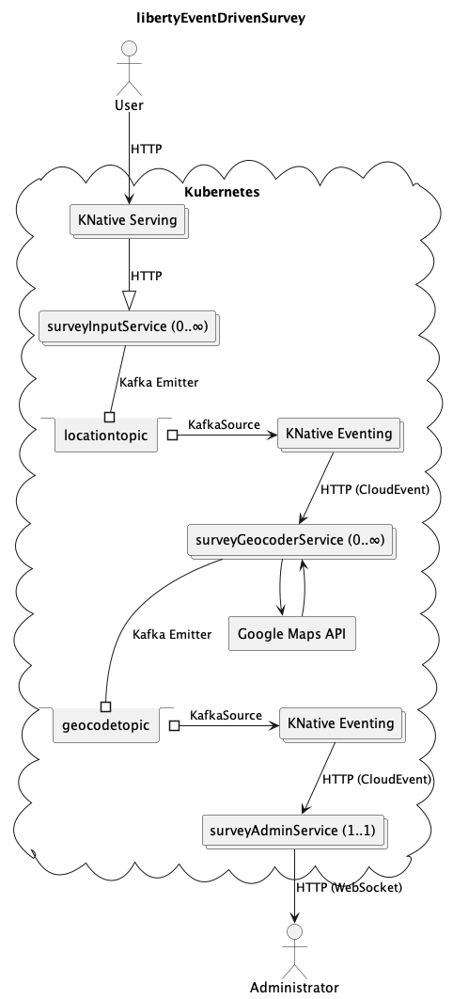

# libertyEventDrivenSurvey

`libertyEventDrivenSurvey` is an example event-driven survey application demonstrating [Liberty InstantOn](https://openliberty.io/docs/latest/instanton.html), CloudEvents, KNative, and MicroProfile Reactive Messaging 3. Architecture diagram for the location geocoding example:



## Development

1. If using `podman machine`:
    1. Set your connection to the `root` connection:
       ```
       podman system connection default podman-machine-default-root
       ```
    1. If the machine has SELinux `virt_sandbox_use_netlink` disabled (i.e. the following returns `off`):
       ```
       podman machine ssh "getsebool virt_sandbox_use_netlink"
       ```
       Then, enable it:
       ```
       podman machine ssh "setsebool virt_sandbox_use_netlink 1"
       ```
       Note that this must be done after every time the podman machine restarts.
1. Build:
   ```
   mvn clean deploy
   ```

### Deploy to OpenShift >= 4.13

#### Pre-requisities

1. Install Kafka; for example, the [Red Hat AMQ Streams operator](https://access.redhat.com/documentation/en-us/red_hat_amq_streams/2.4/html/getting_started_with_amq_streams_on_openshift/proc-deploying-cluster-operator-hub-str)
    1. Then, create a cluster } Installed Operators } AMQ Streams } Kafka } Create Instance } my-cluster } Use all default options } Create
    1. Wait for Condition: Ready. If you get a warning about "inter.broker.protocol.version", apply the [known workaround](https://access.redhat.com/solutions/7020156)
    1. Create topics: locationtopic and geocodetopic
1. Install KNative; for example, the [Red Hat OpenShift Serverless operator](https://docs.openshift.com/serverless/1.29/install/install-serverless-operator.html)
    1. Install the [`kn` command line utility](https://docs.openshift.com/serverless/1.29/install/installing-kn.html)
    1. Install [KNative Serving](https://docs.openshift.com/serverless/1.29/install/installing-knative-serving.html) (use default options) and wait for the Ready=True Condition
    1. Install [KNative Eventing](https://docs.openshift.com/serverless/1.29/install/installing-knative-eventing.html) (use default options) and wait for the Ready=True Condition
    1. Install the [`KNativeKafka` broker](https://docs.openshift.com/serverless/1.29/install/installing-knative-eventing.html#serverless-install-kafka-odc_installing-knative-eventing)
        1. channel } enabled; bootstrapServers } my-cluster-kafka-bootstrap.amq-streams-kafka.svc:9092
        1. source } enabled
        1. broker } enabled; defaultConfig } bootstrapServers } my-cluster-kafka-bootstrap.amq-streams-kafka.svc:9092
        1. sink } enabled
1. Ensure the [internal OpenShift registry is available](https://publib.boulder.ibm.com/httpserv/cookbook/Troubleshooting_Recipes-Troubleshooting_OpenShift_Recipes-OpenShift_Use_Image_Registry_Recipe.html)
1. Get a [Google Maps API key](https://developers.google.com/maps/documentation/javascript/get-api-key) (simple usage should fit [within the free tier](https://mapsplatform.google.com/pricing/))
1. Check the current project is some test project name:
   ```
   oc project
   ```
    1. If not, create and switch to some test project:
       ```
       oc new-project libertysurvey
       ```
1. Create a service account for InstantOn:
   ```
   oc create serviceaccount instanton-sa
   ```
1. Create an InstantOn SecurityContextConstraints:
   ```
   oc apply -f doc/instantonscc.yaml
   ```
1. Associate the InstantOn SecurityContextConstraints with the service account:
   ```
   oc adm policy add-scc-to-user cap-cr-scc -z instanton-sa
   ```
1. Dump the current knative-serving ConfigMap:
   ```
   oc get configmap config-features --namespace knative-serving -o yaml > knative_config.yaml
   ```
1. Edit knative_config.yaml and add the following attributes to the `data:` value:
   ```
   data:
     kubernetes.podspec-securitycontext: "enabled"
     kubernetes.containerspec-addcapabilities: "enabled"
   ```
1. Update the current knative-serving ConfigMap:
   ```
   oc apply -f knative_config.yaml
   ```

#### Deploy surveyAdminService

1. Push `surveyAdminService` to the registry:
   ```
   REGISTRY=$(oc get route default-route -n openshift-image-registry --template='{{ .spec.host }}')
   echo "Registry host: ${REGISTRY}"
   printf "Does it look good (yes=ENTER, no=Ctrl^C)? "
   read trash
   podman login --tls-verify=false -u $(oc whoami | sed 's/://g') -p $(oc whoami -t) ${REGISTRY}
   podman tag localhost/surveyadminservice $REGISTRY/libertysurvey/surveyadminservice
   podman push --tls-verify=false $REGISTRY/libertysurvey/surveyadminservice
   ```
1. Create a KNative Service for `surveyAdminService` replacing `INSERT_API_KEY` with your Google Maps API key and the `kafka.bootstrap.servers` envar value with the AMQ Streams Kafka Cluster bootstrap address:
   ```
   apiVersion: serving.knative.dev/v1
   kind: Service
   metadata:
     name: surveyadminservice
   spec:
     template:
       metadata:
         annotations:
           autoscaling.knative.dev/min-scale: "1"
           autoscaling.knative.dev/max-scale: "1"
       spec:
         serviceAccountName: instanton-sa
         containers:
         - name: surveyadminservice
           image: image-registry.openshift-image-registry.svc:5000/libertysurvey/surveyadminservice
           imagePullPolicy: Always
           env:
           - name: kafka.bootstrap.servers
             value: my-cluster-kafka-bootstrap.amq-streams-kafka.svc:9092
           - name: GOOGLE_API_KEY
             value: INSERT_API_KEY
           securityContext:
             allowPrivilegeEscalation: true
             privileged: false
             runAsNonRoot: true
             capabilities:
               add:
               - CHECKPOINT_RESTORE
               - SETPCAP
               drop:
               - ALL
   ```
   Apply:
   ```
   oc apply -f doc/example_surveyadminservice.yaml
   ```
1. Query until `READY` is `True`:
   ```
   kn service list surveyadminservice
   ```
1. Double check logs look good:
   ```
   oc logs $(oc get pod -o name | grep surveyadminservice)
   oc exec -it $(oc get pod -o name | grep surveyadminservice) -c surveyadminservice -- cat /logs/messages.log
   ```
1. Open your browser to the URL from the `kn service list` output above.
1. Click `Start New Geolocation Survey`
1. Create a KNative Eventing KafkaSource for `surveyAdminService` replacing `bootstrapServers` with the AMQ Streams Kafka Cluster bootstrap address:
   ```
   apiVersion: sources.knative.dev/v1beta1
   kind: KafkaSource
   metadata:
     name: geocodetopicsource
   spec:
     bootstrapServers:
     - my-cluster-kafka-bootstrap.amq-streams-kafka.svc:9092
     sink:
       ref:
         apiVersion: serving.knative.dev/v1
         kind: Service
         name: surveyadminservice
       uri: "/api/cloudevents/geocodeComplete"
     topics:
     - geocodetopic
   ```
   Apply:
   ```
   oc apply -f doc/example_surveyadminkafkasource.yaml
   ```
1. Query until `OK` is `++`:
   ```
   kn source kafka describe geocodetopicsource
   ```
1. Tail the main pod logs:
   ```
   oc exec -it $(oc get pod -o name | grep surveyadminservice) -c surveyadminservice -- tail -f /logs/messages.log
   ```

#### Deploy surveyGeocoderService

1. Push `surveyGeocoderService` to the registry:
   ```
   REGISTRY=$(oc get route default-route -n openshift-image-registry --template='{{ .spec.host }}')
   echo "Registry host: ${REGISTRY}"
   printf "Does it look good (yes=ENTER, no=Ctrl^C)? "
   read trash
   podman login --tls-verify=false -u $(oc whoami | sed 's/://g') -p $(oc whoami -t) ${REGISTRY}
   podman tag localhost/surveygeocoderservice $REGISTRY/libertysurvey/surveygeocoderservice
   podman push --tls-verify=false $REGISTRY/libertysurvey/surveygeocoderservice
   ```
1. Create a KNative Service for `surveyGeocoderService` replacing `INSERT_API_KEY` with your Google Maps API key and the `kafka.bootstrap.servers` envar value with the AMQ Streams Kafka Cluster bootstrap address:
   ```
   apiVersion: serving.knative.dev/v1
   kind: Service
   metadata:
     name: surveygeocoderservice
   spec:
     template:
       metadata:
         annotations:
           autoscaling.knative.dev/scale-down-delay: "0s"
       spec:
         serviceAccountName: instanton-sa
         containers:
         - name: surveygeocoderservice
           image: image-registry.openshift-image-registry.svc:5000/libertysurvey/surveygeocoderservice
           imagePullPolicy: Always
           env:
           - name: kafka.bootstrap.servers
             value: my-cluster-kafka-bootstrap.amq-streams-kafka.svc:9092
           - name: GOOGLE_API_KEY
             value: INSERT_API_KEY
           securityContext:
             allowPrivilegeEscalation: true
             privileged: false
             runAsNonRoot: true
             capabilities:
               add:
               - CHECKPOINT_RESTORE
               - SETPCAP
               drop:
               - ALL
   ```
   Apply:
   ```
   oc apply -f doc/example_surveygeocoderservice.yaml
   ```
1. Query until `READY` is `True`:
   ```
   kn service list surveygeocoderservice
   ```
1. Access the URL to drive pod creation:
   ```
   curl -k "$(kn service list surveygeocoderservice -o jsonpath="{.items[0].status.url}{'\n'}")"
   ```
1. Double check logs look good:
   ```
   oc exec -it $(oc get pod -o name | grep surveygeocoderservice) -c surveygeocoderservice -- cat /logs/messages.log
   ```
1. Create a KNative Eventing KafkaSource for `surveyGeocoderService` replacing `bootstrapServers` with the AMQ Streams Kafka Cluster bootstrap address:
   ```
   apiVersion: sources.knative.dev/v1beta1
   kind: KafkaSource
   metadata:
     name: locationtopicsource
   spec:
     bootstrapServers:
     - my-cluster-kafka-bootstrap.amq-streams-kafka.svc:9092
     sink:
       ref:
         apiVersion: serving.knative.dev/v1
         kind: Service
         name: surveygeocoderservice
       uri: "/api/cloudevents/locationInput"
     topics:
     - locationtopic
   ```
   Apply:
   ```
   oc apply -f doc/example_surveygeocoderkafkasource.yaml
   ```
1. Query until `OK` is `++`:
   ```
   kn source kafka describe locationtopicsource
   ```
1. Tail the main pod logs:
   ```
   oc exec -it $(oc get pod -o name | grep surveygeocoderservice) -c surveygeocoderservice -- tail -f /logs/messages.log
   ```

#### Deploy surveyInputService

1. Push `surveyInputService` to the registry:
   ```
   REGISTRY=$(oc get route default-route -n openshift-image-registry --template='{{ .spec.host }}')
   echo "Registry host: ${REGISTRY}"
   printf "Does it look good (yes=ENTER, no=Ctrl^C)? "
   read trash
   podman login --tls-verify=false -u $(oc whoami | sed 's/://g') -p $(oc whoami -t) ${REGISTRY}
   podman tag localhost/surveyinputservice $REGISTRY/libertysurvey/surveyinputservice
   podman push --tls-verify=false $REGISTRY/libertysurvey/surveyinputservice
   ```
1. Create a KNative Service for `surveyInputService` replacing the `kafka.bootstrap.servers` envar value with the AMQ Streams Kafka Cluster bootstrap address:
   ```
   apiVersion: serving.knative.dev/v1
   kind: Service
   metadata:
     name: surveyinputservice
   spec:
     template:
       metadata:
         annotations:
           autoscaling.knative.dev/scale-down-delay: "0s"
       spec:
         serviceAccountName: instanton-sa
         containers:
         - name: surveyinputservice
           image: image-registry.openshift-image-registry.svc:5000/libertysurvey/surveyinputservice
           imagePullPolicy: Always
           env:
           - name: kafka.bootstrap.servers
             value: my-cluster-kafka-bootstrap.amq-streams-kafka.svc:9092
           securityContext:
             allowPrivilegeEscalation: true
             privileged: false
             runAsNonRoot: true
             capabilities:
               add:
               - CHECKPOINT_RESTORE
               - SETPCAP
               drop:
               - ALL
   ```
   Apply:
   ```
   oc apply -f doc/example_surveyinputservice.yaml
   ```
1. Query until `READY` is `True`:
   ```
   kn service list surveyinputservice
   ```
1. Access the URL to drive pod creation:
   ```
   curl -k "$(kn service list surveyinputservice -o jsonpath="{.items[0].status.url}{'\n'}")"
   ```
1. Double check logs look good:
   ```
   oc exec -it $(oc get pod -o name | grep surveyinputservice) -c surveyinputservice -- cat /logs/messages.log
   ```

#### Test

1. Submit a location input:
    1. Using the command line:
        1. Execute:
           ```
           curl -k --data "textInput1=New York, NY" "$(kn service list surveyinputservice -o jsonpath="{.items[0].status.url}{'\n'}")/LocationSurvey"
           ```
        1. Check for a successful output:
           ```
           Your submission has been received
           ```
    1. Using the browser:
        1. Find and open the URL:
           ```
           kn service list surveyinputservice -o jsonpath="{.items[0].status.url}{'\n'}"
           ```
        1. Click `Location Survey` and submit the form
1. Double check logs look good:
   ```
   oc exec -it $(oc get pod -o name | grep surveygeocoderservice) -c surveygeocoderservice -- tail -f /logs/messages.log
   ```

#### Clean-up tasks

##### Delete surveyAdminService

1. Delete the KafkaSource:
   ```
   kn source kafka delete geocodetopicsource
   ```
1. Delete the KNative Service:
   ```
   kn service delete surveyadminservice
   ```

##### Delete surveyGeocoderService

1. Delete the KafkaSource:
   ```
   kn source kafka delete locationtopicsource
   ```
1. Delete the KNative Service:
   ```
   kn service delete surveygeocoderservice
   ```

##### Delete surveyInputService

```
kn service delete surveyinputservice
```

### Testing Locally

Only some functions can be tested locally without KNative.

#### Testing surveyAdminService

1. Run `surveyAdminService`:
   ```
   podman run --privileged --rm -p 8080:8080 -p 8443:8443 -it localhost/surveyadminservice:latest
   ```
1. Open browser to <http://localhost:8080/geolocation.jsp>
1. Post a [`CloudEvent`](https://github.com/cloudevents/spec/blob/v1.0/spec.md#required-attributes):
   ```
   curl -X POST http://localhost:8080/api/cloudevents/geocodeComplete \
     -H "Ce-Source: https://example.com/" \
     -H "Ce-Id: $(uuidgen)" \
     -H "Ce-Specversion: 1.0" \
     -H "Ce-Type: CloudEvent1" \
     -H "Content-Type: text/plain" \
     -d "40.7127753 -74.0059728 New York, NY"
   ```
1. Switch back to the browser and you should see the point.

#### Testing surveyInputService

1. Create Kafka container network if it doesn't exist:
   ```
   podman network create kafka
   ```
1. Start Kafka if it's not started:
   ```
   podman run --rm -p 9092:9092 -e "ALLOW_PLAINTEXT_LISTENER=yes" -e "KAFKA_CFG_ADVERTISED_LISTENERS=PLAINTEXT://kafka-0:9092" -e "KAFKA_CFG_LISTENERS=PLAINTEXT://:9092,CONTROLLER://:9093" -e "KAFKA_CFG_LISTENER_SECURITY_PROTOCOL_MAP=CONTROLLER:PLAINTEXT,PLAINTEXT:PLAINTEXT" -e "KAFKA_CFG_CONTROLLER_QUORUM_VOTERS=0@kafka-0:9093" -e "KAFKA_CFG_CONTROLLER_LISTENER_NAMES=CONTROLLER" -e "KAFKA_CFG_PROCESS_ROLES=controller,broker" -e "KAFKA_CFG_NODE_ID=0" --name kafka-0 --network kafka docker.io/bitnami/kafka
   ```
1. Run `surveyInputService`:
   ```
   podman run --privileged --rm --network kafka  --rm -p 8080:8080 -p 8443:8443 -it localhost/surveyinputservice:latest
   ```
1. Wait for the message:
   ```
   [...] CWWKZ0001I: Application surveyInputService started [...]
   ```
1. Access <http://localhost:8080/location.html> or <https://localhost:8443/location.html>

#### Testing surveyGeocoderService

1. Create Kafka container network if it doesn't exist:
   ```
   podman network create kafka
   ```
1. Start Kafka if it's not started:
   ```
   podman run --rm -p 9092:9092 -e "ALLOW_PLAINTEXT_LISTENER=yes" -e "KAFKA_CFG_ADVERTISED_LISTENERS=PLAINTEXT://kafka-0:9092" -e "KAFKA_CFG_LISTENERS=PLAINTEXT://:9092,CONTROLLER://:9093" -e "KAFKA_CFG_LISTENER_SECURITY_PROTOCOL_MAP=CONTROLLER:PLAINTEXT,PLAINTEXT:PLAINTEXT" -e "KAFKA_CFG_CONTROLLER_QUORUM_VOTERS=0@kafka-0:9093" -e "KAFKA_CFG_CONTROLLER_LISTENER_NAMES=CONTROLLER" -e "KAFKA_CFG_PROCESS_ROLES=controller,broker" -e "KAFKA_CFG_NODE_ID=0" --name kafka-0 --network kafka docker.io/bitnami/kafka
   ```
1. Run `surveyGeocoderService`:
   ```
   podman run --privileged --rm -p 8080:8080 -p 8443:8443 -e "GOOGLE_API_KEY=INSERT_API_KEY" -it localhost/surveygeocoderservice:latest
   ```
1. Post a [`CloudEvent`](https://github.com/cloudevents/spec/blob/v1.0/spec.md#required-attributes):
   ```
   curl -X POST http://localhost:8080/api/cloudevents/locationInput \
     -H "Ce-Source: https://example.com/" \
     -H "Ce-Id: $(uuidgen)" \
     -H "Ce-Specversion: 1.0" \
     -H "Ce-Type: CloudEvent1" \
     -H "Content-Type: text/plain" \
     -d "New York, NY"
   ```

#### Testing without containers

1. Change directory to the application
1. `GOOGLE_API_KEY=INSERT_API_KEY mvn clean liberty:dev`

## Learn More

1. <https://developer.ibm.com/articles/develop-reactive-microservices-with-microprofile/>
1. <https://openliberty.io/guides/microprofile-reactive-messaging.html>
1. <https://smallrye.io/smallrye-reactive-messaging/latest/concepts/concepts/>
1. <https://openliberty.io/blog/2022/10/17/microprofile-serverless-ibm-code-engine.html>
1. <https://github.com/OpenLiberty/open-liberty/issues/19889>
1. <https://github.com/OpenLiberty/open-liberty/issues/21659>
